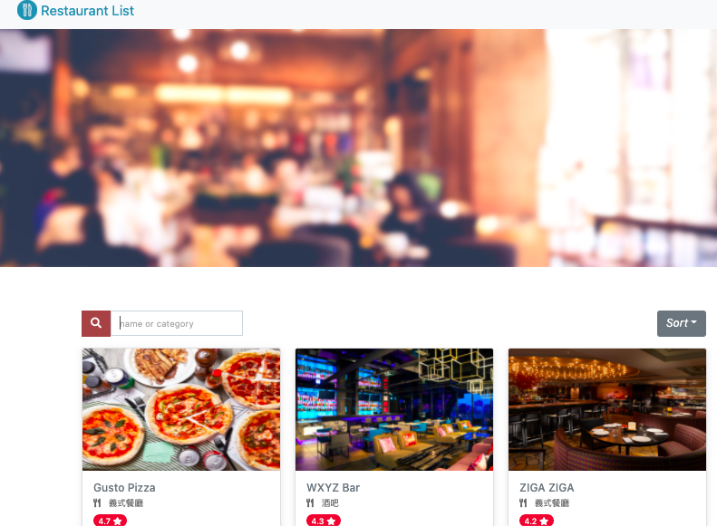

# Restaurant List

## Features
- You can see 8 restaurants information in this website (photo, name, category, rating)
- You can click each restaurant to see more information (phone, address...)
- You can use search bar to find restaurant (type name or category)

## What I used
- express: 4.17.1, express-handlebars: 5.3.2
- Bootstrap, jQuery, Popper.js and Font Awesome

## How to Use
- git clone https://github.com/carolebot/A1_restaurant_list.git
- open your terminal
- `cd` to restaurant list file
- type `npm install`
- type `npm run dev`
- You will see `running https://localhost:3000` 
- You can open http://localhost:3000 on your browser and check Restaurant List now
